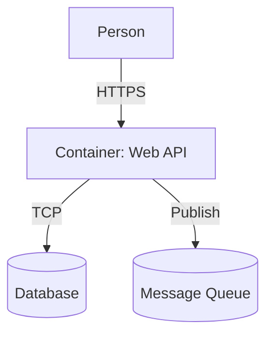

# ArchFlow Diagram

**ArchFlow Diagram** provides the domain model for C4 architecture diagrams within the ArchFlow platform. It implements a pure Domain-Driven Design (DDD) layer that defines the core concepts, aggregates, and business rules for software architecture modeling.

## Overview

ArchFlow Diagram serves as the **domain core** for architectural modeling, providing:

- **C4 Model hierarchy**: System, Container, Component, and Code levels
- **Entity types**: Person, SoftwareSystem, Database, MessageQueue, etc.
- **Value objects**: C4Level, CloudProvider for infrastructure-as-code
- **Rich metadata**: ArchitectureData with technology stack, descriptions, tags
- **Domain events**: Immutable facts about diagram changes
- **Aggregates**: Consistency boundaries for diagram entities

## Architecture

```
┌─────────────────────────────────────────────────────────────────────┐
│                       ArchFlow Diagram                            │
│                      (Domain Core - no_std)                       │
├─────────────────────────────────────────────────────────────────────┤
│                                                                       │
│  ┌─────────────┐  ┌──────────────┐  ┌─────────────────────┐    │
│  │   C4 Model  │  │ Value Objects│  │   Aggregates       │    │
│  │             │  │              │  │                     │    │
│  │ • Person    │  │ • C4Level    │  │ • DiagramAggregate  │    │
│  │ • System    │  │ • CloudProv. │  │ • GroupAggregate   │    │
│  │ • Container │  │ • EntityType │  │ • ConnectionAggr.  │    │
│  │ • Component │  │              │  │                     │    │
│  │ • Database  │  │              │  │                     │    │
│  └─────────────┘  └──────────────┘  └─────────────────────┘    │
│                                                                       │
└─────────────────────────────────────────────────────────────────────┘
```

## Core Domain Concepts

### C4 Model Hierarchy

The C4 model provides four levels of abstraction:

```
Level 0: System Context
    └── Shows: Person → SoftwareSystem relationships

Level 1: Container View
    └── Shows: Containers (apps, databases, queues) within systems

Level 2: Component View
    └── Shows: Components within containers

Level 3: Code View
    └── Shows: Classes, functions, interfaces
```

**Navigation:**
```rust
pub enum C4Level {
    System,     // Level 0: Context diagrams
    Container,  // Level 1: Technology deployment
    Component,  // Level 2: Internal structure
    Code,       // Level 3: Implementation details
}

impl C4Level {
    pub fn next_level(&self) -> Option<Self>;
    pub fn prev_level(&self) -> Option<Self>;
    pub fn as_u8(&self) -> u8;
}
```

### Entity Types

ArchFlow Diagram supports all standard C4 entity types:

```rust
pub enum C4EntityType {
    Person,           // External users or actors
    SoftwareSystem,   // External software systems
    Container,        // Deployable applications/services
    Component,        // Logical components within containers
    Database,         // Data stores and databases
    MessageQueue,     // Message buses and queues
    ExternalService,  // Third-party APIs and services
    Generic,          // Custom entity types
}
```

**Visual mapping:**
| Type | Color | Shape | Icon |
|------|-------|-------|------|
| Person | Gray | Rectangle | Person icon |
| SoftwareSystem | Dark blue | Rectangle | System icon |
| Container | Light blue | Rectangle | Container icon |
| Component | Very light blue | Rectangle | Component icon |
| Database | Light gray | Cylinder | Database icon |
| MessageQueue | Orange | Rectangle | Queue icon |
| ExternalService | Pink | Rectangle | External icon |

### Cloud Providers

For Infrastructure-as-Code generation, entities can specify cloud providers:

```rust
pub enum CloudProvider {
    None,      // On-premise or unspecified
    AWS,       // Amazon Web Services
    GCP,       // Google Cloud Platform
    Azure,     // Microsoft Azure
}
```

**This affects export generation:**
- **Mermaid**: Color schemes and styling
- **Terraform**: Resource types and configurations
- **DrawIO**: Shape libraries and stencils

### ArchitectureData

Each entity carries rich metadata:

```rust
pub struct ArchitectureData {
    /// Entity name (displayed in diagrams)
    pub name: String,
    
    /// Description of purpose/responsibilities
    pub description: String,
    
    /// C4 hierarchy level
    pub c4_level: C4Level,
    
    /// C4 entity type
    pub entity_type: C4EntityType,
    
    /// Cloud provider for IaC export
    pub cloud_provider: CloudProvider,
    
    /// Technology stack (e.g., "Rust", "PostgreSQL")
    pub technology: String,
    
    /// Categorization tags
    pub tags: Vec<String>,
}
```

## Domain Events

The domain emits immutable events for state changes:

```rust
pub enum DiagramEvent {
    EntityCreated { id: EntityId, data: ArchitectureData },
    EntityUpdated { id: EntityId, old_data: ArchitectureData, new_data: ArchitectureData },
    EntityDeleted { id: EntityId },
    
    GroupCreated { id: EntityId, name: String },
    GroupEntitiesChanged { id: EntityId, entity_ids: Vec<EntityId> },
    
    ConnectionCreated { id: EntityId, from: EntityId, to: EntityId },
    ConnectionDeleted { id: EntityId },
}
```

**Event properties:**
- **Immutable**: Events cannot be modified after creation
- **Serializable**: All events can be persisted
- **Queryable**: Event sourcing enables full history reconstruction

## Aggregates

ArchFlow Diagram implements DDD aggregates as consistency boundaries:

### DiagramAggregate

Root aggregate for the entire diagram:

```rust
pub struct DiagramAggregate {
    id: DiagramId,
    name: String,
    description: String,
    c4_level: C4Level,
}

impl DiagramAggregate {
    /// Add an entity to the diagram
    pub fn add_entity(&mut self, data: ArchitectureData) -> Result<EntityId, DiagramError>;
    
    /// Update an existing entity
    pub fn update_entity(&mut self, id: EntityId, data: ArchitectureData) -> Result<(), DiagramError>;
    
    /// Remove an entity
    pub fn remove_entity(&mut self, id: EntityId) -> Result<(), DiagramError>;
    
    /// Get entities by C4 level
    pub fn entities_at_level(&self, level: C4Level) -> Vec<&ArchitectureData>;
}
```

**Invariants:**
- Entity names must be unique within a diagram
- Entity IDs must be unique across the system
- Parent entities must exist before adding children

### GroupAggregate

Manages grouped entities with hierarchical consistency:

```rust
pub struct GroupAggregate {
    id: EntityId,
    name: String,
    entity_ids: Vec<EntityId>,
}

impl GroupAggregate {
    /// Add an entity to the group
    pub fn add_entity(&mut self, entity_id: EntityId) -> Result<(), GroupError>;
    
    /// Remove an entity from the group
    pub fn remove_entity(&mut self, entity_id: EntityId) -> Result<(), GroupError>;
    
    /// Get all entities in the group
    pub fn entities(&self) -> &[EntityId];
}
```

**Invariants:**
- Groups cannot contain themselves
- Circular group hierarchies are not allowed
- Entity must exist before adding to group

### ConnectionAggregate

Ensures valid connections between entities:

```rust
pub struct ConnectionAggregate {
    id: EntityId,
    from: EntityId,
    to: EntityId,
    connection_type: ConnectionType,
    label: Option<String>,
}

impl ConnectionAggregate {
    /// Create a new connection
    pub fn new(from: EntityId, to: EntityId, connection_type: ConnectionType) -> Result<Self, ConnectionError>;
    
    /// Validate the connection
    pub fn validate(&self, entities: &HashMap<EntityId, ArchitectureData>) -> Result<(), ConnectionError>;
}
```

**Invariants:**
- Cannot connect an entity to itself
- Source and target entities must exist
- Connection types must be compatible with entity types

## Value Objects

### C4Level

Represents the C4 hierarchy level with validation:

```rust
pub struct C4Level(pub u8);

impl C4Level {
    pub const SYSTEM: C4Level = C4Level(0);
    pub const CONTAINER: C4Level = C4Level(1);
    pub const COMPONENT: C4Level = C4Level(2);
    pub const CODE: C4Level = C4Level(3);
    
    pub fn new(level: u8) -> Result<Self, DomainError>;
    pub fn next_level(&self) -> Option<Self>;
    pub fn prev_level(&self) -> Option<Self>;
}
```

### EntityType

Typed representation of C4 entity types:

```rust
pub struct C4EntityType(pub u8);

impl C4EntityType {
    pub const PERSON: C4EntityType = C4EntityType(0);
    pub const SOFTWARE_SYSTEM: C4EntityType = C4EntityType(1);
    pub const CONTAINER: C4EntityType = C4EntityType(2);
    pub const COMPONENT: C4EntityType = C4EntityType(3);
    // ... etc
    
    pub fn default_color(&self) -> u32;
    pub fn default_shape(&self) -> ShapeType;
}
```

### CloudProvider

Infrastructure provider specification:

```rust
pub struct CloudProvider(pub u8);

impl CloudProvider {
    pub const NONE: CloudProvider = CloudProvider(0);
    pub const AWS: CloudProvider = CloudProvider(1);
    pub const GCP: CloudProvider = CloudProvider(2);
    pub const AZURE: CloudProvider = CloudProvider(3);
}
```

## Module Organization

```
archflow-diagram/
├── lib.rs              # Public API and re-exports
├── c4.rs               # C4 model types and value objects
├── aggregates.rs       # DDD aggregate roots
├── commands.rs         # Domain commands (intentions)
└── events.rs           # Domain events (facts)
```

## Export Formats

ArchFlow Diagram integrates with export crates for multiple output formats:

### Mermaid Export

Generated by `archflow-export` crate:



**Features:**
- C4 level-aware diagram generation
- Color coding by cloud provider
- Automatic connection routing
- Group hierarchy visualization

### Terraform Export

Generated by `archflow-export` crate:

```hcl
# Container → AWS EC2 Instance
resource "aws_instance" "web_api" {
  ami           = data.aws_ami.amazon_linux_2.id
  instance_type = "t3.micro"
  
  tags = {
    Name = "web-api"
    Type = "container"
  }
}

# Database → AWS RDS
resource "aws_rds_instance" "database" {
  engine         = "postgres"
  instance_class = "db.t3.micro"
  
  tags = {
    Name = "database"
    Type = "database"
  }
}

# Connection → Security Group Rule
resource "aws_security_group_rule" "api_to_db" {
  type                     = "ingress"
  from_port                = 5432
  to_port                  = 5432
  protocol                  = "tcp"
  source_security_group_id = aws_instance.web_api.security_group_id
}
```

**Entity-to-Resource Mapping:**
| C4 Type | AWS Resource | GCP Resource | Azure Resource |
|---------|-------------|--------------|---------------|
| Container | `aws_instance` | `compute_instance` | `linux_virtual_machine` |
| Database | `aws_rds_instance` | `sql_database_instance` | `sql_server` |
| MessageQueue | `aws_sqs_queue` | `pubsub_topic` | `servicebus_queue` |

### DrawIO Export

Generated by `archflow-plugins` crate:

```xml
<mxfile>
  <diagram name="Architecture">
    <mxGraphModel dx="1422" dy="794" grid="1" gridSize="10">
      <!-- Container: Web API -->
      <mxCell id="web_api" value="Web API" style="rounded=0;whiteSpace=wrap;html=1;" vertex="1" parent="1">
        <mxGeometry x="400" y="200" width="120" height="60" as="geometry"/>
      </mxCell>
      <!-- Database -->
      <mxCell id="database" value="Database" style="shape=cylinder3;whiteSpace=wrap;html=1;boundedLbl=1;backgroundOutline=1;" vertex="1" parent="1">
        <mxGeometry x="400" y="320" width="80" height="80" as="geometry"/>
      </mxCell>
    </mxGraphModel>
  </diagram>
</mxfile>
```

## Usage Examples

### Creating a Diagram

```rust
use archflow_diagram::{DiagramAggregate, ArchitectureData, C4Level, C4EntityType};

let mut diagram = DiagramAggregate::new(
    "E-Commerce System",
    "High-level e-commerce architecture"
);

// Add a system
let system_id = diagram.add_entity(ArchitectureData {
    name: "Web Shop".to_string(),
    description: "Customer-facing web application".to_string(),
    c4_level: C4Level::System,
    entity_type: C4EntityType::SoftwareSystem,
    cloud_provider: CloudProvider::AWS,
    technology: "React, Node.js".to_string(),
    tags: vec!["frontend".to_string(), "web".to_string()],
})?;
```

### Creating Containers

```rust
// Add containers within the system
let web_api = diagram.add_entity(ArchitectureData {
    name: "Web API".to_string(),
    description: "RESTful API for e-commerce operations".to_string(),
    c4_level: C4Level::Container,
    entity_type: C4EntityType::Container,
    cloud_provider: CloudProvider::AWS,
    technology: "Rust, Axum".to_string(),
    tags: vec!["api".to_string(), "backend".to_string()],
})?;

let database = diagram.add_entity(ArchitectureData {
    name: "Orders DB".to_string(),
    description: "PostgreSQL database for order data".to_string(),
    c4_level: C4Level::Container,
    entity_type: C4EntityType::Database,
    cloud_provider: CloudProvider::AWS,
    technology: "PostgreSQL 15".to_string(),
    tags: vec!["database".to_string(), "storage".to_string()],
})?;
```

### Creating Connections

```rust
use archflow_diagram::ConnectionAggregate;

let connection = ConnectionAggregate::new(
    web_api,      // From: Web API
    database,     // To: Orders DB
    ConnectionType::Synchronous,
)?;

connection.set_label("SQL");
```

### Exporting to Mermaid

```rust
use archflow_export::mermaid::MermaidExporter;

let exporter = MermaidExporter::new();
let mermaid_code = exporter.export_diagram(&diagram)?;

println!("{}", mermaid_code);
```

### Exporting to Terraform

```rust
use archflow_export::terraform::TerraformExporter;

let exporter = TerraformExporter::new();
let terraform_code = exporter.export_diagram(&diagram)?;

println!("{}", terraform_code);
```

## Performance Characteristics

| Operation | Complexity | Notes |
|-----------|-----------|-------|
| Entity creation | O(1) | Direct insertion |
| Entity lookup | O(1) | Hash-based indexing |
| Level traversal | O(n) | n = entities at level |
| Export generation | O(n + m) | n = entities, m = connections |

## Design Principles

### Domain-Driven Design

- **Ubiquitous Language**: C4 terminology throughout
- **Bounded Context**: Clear separation from other domains
- **Aggregates**: Consistency boundaries for entities
- **Events vs Commands**: Immutable facts vs intentions

### No_std Compatibility

- **Copy types**: All domain objects are `Copy`
- **No allocation**: Core domain logic avoids heap allocation
- **WASM-ready**: Compiles to WebAssembly

### Portability

- **Provider-agnostic**: Works with AWS, GCP, Azure, or on-premise
- **Format-independent**: Domain logic separated from export
- **Extensible**: Easy to add new entity types or export formats

## Integration Points

ArchFlow Diagram integrates with:

| Crate | Integration Type |
|-------|------------------|
| `archflow-core` | Uses EntityId, Vec2, Color types |
| `archflow-engine` | Implements aggregate persistence |
| `archflow-export` | Generates Mermaid, Terraform, DrawIO |
| `archflow-web-ui` | Diagram editing interface |

## Feature Flags

| Feature | Description | Default |
|---------|-------------|---------|
| `std` | Enable standard library integration | No |
| `serde` | Enable serialization support | No |
| `export` | Enable export functionality | Yes |

## Dependencies

- **archflow-core**: Shared types and math primitives
- **serde**: Serialization support (optional)
- **thiserror**: Error handling (optional)

## License

MIT OR Apache-2.0
