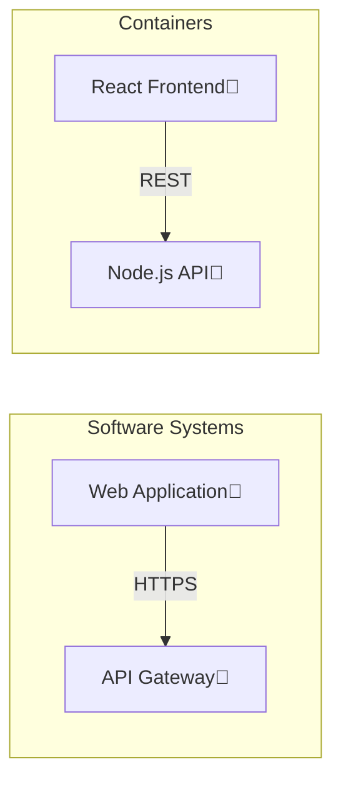

# archflow-export

> **Multi-Format Export System** - Transform architectural diagrams into Mermaid diagrams, Terraform configurations, and compact binary serialization.

## Overview

`archflow-export` provides a comprehensive export system for architectural diagrams created with ArchFlow. It supports multiple output formats tailored for different use cases: documentation (Mermaid), infrastructure provisioning (Terraform), and data persistence (binary).

**Key Capabilities:**
- **Mermaid diagrams** - Flowchart, sequence, state, ER, and class diagrams
- **Terraform configurations** - AWS, GCP, Azure infrastructure generation
- **Binary serialization** - Compact project persistence with integrity validation
- **Plugin-ready architecture** - Extensible design for future formats

## Architecture

The crate follows **hexagonal architecture** with format-specific modules:

```
┌─────────────────────────────────────────────────────────────────┐
│                       Export Interface                          │
│  ┌──────────────┐  ┌──────────────┐  ┌──────────────┐          │
│  │MermaidExporter│  │TerraformExporter│ │ProjectSerializer│      │
│  └──────────────┘  └──────────────┘  └──────────────┘          │
└───────────────────────────┬─────────────────────────────────────┘
                            │
┌───────────────────────────┴─────────────────────────────────────┐
│                      Domain Models                              │
│  ┌──────────────┐  ┌──────────────┐                            │
│  │ EntityStore  │  │ConnectionStore│                           │
│  └──────────────┘  └──────────────┘                            │
└─────────────────────────────────────────────────────────────────┘
```

## Supported Formats

### Mermaid Diagrams

Generate documentation-quality diagrams in multiple Mermaid formats:

```rust
use archflow_export::{MermaidExporter, MermaidDiagramType, MermaidStyle};
use archflow_engine::{EntityStore, ConnectionStore};

// Create exporter
let exporter = MermaidExporter::new()
    .with_diagram_type(MermaidDiagramType::Flowchart)
    .with_direction(FlowchartDirection::TopToBottom)
    .with_style(MermaidStyle::full());

// Generate diagram
let mermaid_code = exporter.export(&entity_store, &connection_store);
```

**Diagram Types:**
| Type | Use Case | Example Output |
|------|----------|----------------|
| `Flowchart` | System overview | `graph TD; A[Web App] --> B[API]` |
| `Sequence` | Interaction flows | `sequenceDiagram; User->>API: Request` |
| `State` | State transitions | `stateDiagram-v2; [*] --> Active` |
| `ER` | Entity relationships | `erDiagram; USER ||--o{ ORDER : has` |
| `Class` | Code structure | `classDiagram; class User { +id }` |

**Configuration Options:**
```rust
let style = MermaidStyle {
    show_badges: true,        // Show entity type badges
    show_technology: true,    // Show technology tags
    group_by_layer: true,     // Group by C4 layer
    color_by_type: true,      // Color-code by entity type
    show_connections: true,   // Include relationships
    include_metadata: false,  // Exclude technical metadata
};
```

### Terraform Configurations

Generate production-ready infrastructure as code:

```rust
use archflow_export::{TerraformExporter, CloudProvider};

let exporter = TerraformExporter::new()
    .with_version("1.5.0")
    .with_aws_provider();

let terraform_code = exporter.export(&entity_store, &connection_store);
```

**Cloud Provider Support:**

| Provider | Services Generated | Example Resources |
|----------|-------------------|-------------------|
| **AWS** | ECS, VPC, ALB, RDS | `aws_ecs_service`, `aws_vpc` |
| **GCP** | GKE, VPC, Cloud SQL | `google_container_cluster` |
| **Azure** | Container Instances, VNet | `azurerm_container_group` |

**Entity-to-Resource Mapping:**

```
Container ──────► aws_ecs_service
Database ───────► aws_rds_cluster
MessageQueue ───► aws_sqs_queue
SoftwareSystem ─► aws_ecs_task_definition
```

**Generated Features:**
- **Networking**: VPC, subnets, security groups, load balancers
- **Compute**: Container services, task definitions
- **Storage**: Database instances, storage buckets
- **Variables**: Input variables for customization
- **Outputs**: Exported resource attributes

### Binary Serialization

Compact binary format for efficient storage and transmission:

```rust
use archflow_export::{ProjectSerializer, ProjectDeserializer};

// Serialize to binary
let binary_data = ProjectSerializer::serialize(&entity_store, &connection_store)?;

// Deserialize back
let (entity_store, connection_store) = ProjectDeserializer::deserialize(&binary_data)?;
```

**Binary Format Structure:**

```
┌─────────────────────────────────────────────────────────┐
│ Header (40 bytes)                                       │
│  ├─ Magic: "ARCHFLOW" (8 bytes)                        │
│  ├─ Version: u32 (4 bytes)                             │
│  ├─ Entity Count: u32 (4 bytes)                        │
│  ├─ Connection Count: u32 (4 bytes)                    │
│  └─ Reserved: (20 bytes)                               │
├─────────────────────────────────────────────────────────┤
│ Entity Chunk (128 bytes per entity)                    │
│  ├─ Position: [f32; 2] (8 bytes)                      │
│  ├─ Size: [f32; 2] (8 bytes)                          │
│  ├─ Color: u32 (4 bytes)                              │
│  ├─ Texture Index: u16 (2 bytes)                      │
│  ├─ Entity Type: u8 (1 byte)                          │
│  ├─ Cloud Provider: u8 (1 byte)                       │
│  └─ Metadata: u64 (8 bytes)                           │
├─────────────────────────────────────────────────────────┤
│ Connection Chunk (48 bytes per connection)             │
│  ├─ From Entity: u32 (4 bytes)                        │
│  ├─ To Entity: u32 (4 bytes)                          │
│  ├─ Anchor From: [f32; 2] (8 bytes)                  │
│  ├─ Anchor To: [f32; 2] (8 bytes)                    │
│  └─ Line Style: u32 (4 bytes)                         │
└─────────────────────────────────────────────────────────┘
```

**Performance Characteristics:**

| Metric | Value | Notes |
|--------|-------|-------|
| Header Size | 40 bytes | Fixed overhead |
| Entity Size | 128 bytes | Per entity |
| Connection Size | 48 bytes | Per connection |
| Compression | N/A | Left to application layer |
| Validation | SHA-256 optional | For integrity checking |

## Data Flow

```
┌──────────────┐     ┌──────────────┐     ┌──────────────┐
│ EntityStore  │────▶│ ArchDataHelper│────▶│   Mermaid    │
│ConnectionStore│    │  (Abstraction)│    │   Exporter   │
└──────────────┘     └──────────────┘     └──────────────┘
                                                 │
                                                 ▼
                                            ┌─────────┐
                                            │ String  │
                                            │ Output  │
                                            └─────────┘
```

The `ArchDataHelper` provides a unified abstraction over the engine's data structures, allowing exporters to access entity information without coupling to the internal representation.

## Usage Examples

### Mermaid Flowchart with Styling

```rust
use archflow_export::{MermaidExporter, MermaidDiagramType, FlowchartDirection, MermaidStyle};

let style = MermaidStyle {
    show_badges: true,
    show_technology: true,
    group_by_layer: true,
    color_by_type: true,
    show_connections: true,
    include_metadata: false,
};

let exporter = MermaidExporter::new()
    .with_diagram_type(MermaidDiagramType::Flowchart)
    .with_direction(FlowchartDirection::LeftToRight)
    .with_style(style);

let diagram = exporter.export(&entity_store, &connection_store);

println!("```mermaid");
println!("{}", diagram);
println!("```");
```

**Output Example:**


### Terraform for AWS

```rust
use archflow_export::{TerraformExporter, CloudProvider};

let exporter = TerraformExporter::new()
    .with_version("1.5.0")
    .with_cloud_provider(CloudProvider::AWS);

let terraform = exporter.export(&entity_store, &connection_store);

// Write to main.tf
std::fs::write("infrastructure/main.tf", terraform)?;
```

**Output Example:**
```hcl
terraform {
  required_version = ">= 1.5.0"
  required_providers {
    aws = {
      source  = "hashicorp/aws"
      version = "~> 5.0"
    }
  }
}

provider "aws" {
  region = "us-east-1"
}

resource "aws_ecs_service" "web_app" {
  name            = "web-app"
  cluster         = aws_ecs_cluster.main.id
  task_definition = aws_ecs_task_definition.web_app.arn
  desired_count   = 2
  
  network_configuration {
    security_groups = [aws_security_group.web.id]
    subnets         = aws_subnet.public[*].id
  }
}
```

### Project Persistence

```rust
use archflow_export::{ProjectSerializer, ProjectDeserializer, SerializeError};
use std::fs;

// Save project
fn save_project(
    entity_store: &EntityStore,
    connection_store: &ConnectionStore,
    path: &str
) -> Result<(), SerializeError> {
    let data = ProjectSerializer::serialize(entity_store, connection_store)?;
    fs::write(path, data)?;
    Ok(())
}

// Load project
fn load_project(path: &str) -> Result<(EntityStore, ConnectionStore), SerializeError> {
    let data = fs::read(path)?;
    ProjectDeserializer::deserialize(&data)
}
```

### Error Handling

```rust
use archflow_export::{SerializeError, DeserializeError};

match ProjectSerializer::serialize(&entity_store, &connection_store) {
    Ok(data) => {
        println!("Serialized {} bytes", data.len());
    }
    Err(SerializeError::TooManyEntities(count)) => {
        eprintln!("Too many entities: {} (max: {})", count, MAX_ENTITIES);
    }
    Err(SerializeError::InvalidEntity(id)) => {
        eprintln!("Invalid entity: {}", id);
    }
    Err(e) => {
        eprintln!("Serialization error: {:?}", e);
    }
}
```

## Error Types

### SerializeError

```rust
pub enum SerializeError {
    TooManyEntities(usize),
    TooManyConnections(usize),
    InvalidEntity(EntityId),
    InvalidConnection(EntityId),
    IoError(std::io::Error),
}
```

### DeserializeError

```rust
pub enum DeserializeError {
    InvalidMagic([u8; 8]),
    UnsupportedVersion(u32),
    CorruptedData(String),
    InvalidEntityCount(u32),
    InvalidConnectionCount(u32),
    IoError(std::io::Error),
}
```

## Extensibility

The modular design allows adding new export formats:

```rust
// Create custom exporter
pub struct CustomExporter {
    options: ExportOptions,
}

impl CustomExporter {
    pub fn new() -> Self {
        Self { options: ExportOptions::default() }
    }

    pub fn export(
        &self,
        entities: &EntityStore,
        connections: &ConnectionStore
    ) -> String {
        // Custom export logic
        format!("Custom format output")
    }
}
```

**Recommended Pattern:**
1. Create `format.rs` module
2. Implement `Exporter` trait
3. Add builder pattern for configuration
4. Use `ArchDataHelper` for data access
5. Add comprehensive unit tests

## Integration with Other Crates

```toml
[dependencies]
archflow-export = { version = "0.36", features = ["mermaid", "terraform"] }
archflow-engine = "0.36"
archflow-diagram = "0.36"
archflow-core = "0.36"
```

**Feature Flags:**
- `mermaid` - Mermaid diagram export (default)
- `terraform` - Terraform generation (default)
- `serialization` - Binary serialization (default)
- `all` - All features enabled

## Performance Benchmarks

| Operation | 100 Entities | 1,000 Entities | 10,000 Entities |
|-----------|--------------|----------------|-----------------|
| Mermaid Export | ~1ms | ~5ms | ~50ms |
| Terraform Export | ~2ms | ~15ms | ~150ms |
| Serialize | <1ms | ~2ms | ~20ms |
| Deserialize | <1ms | ~2ms | ~20ms |

*Benchmarks performed on Intel i7-12700K, single-threaded*

## Design Decisions

### Why Builder Pattern?

Each exporter uses method chaining for configuration:

```rust
let exporter = MermaidExporter::new()
    .with_diagram_type(MermaidDiagramType::Flowchart)
    .with_direction(FlowchartDirection::LeftToRight)
    .with_style(style);
```

**Benefits:**
- Fluent, readable API
- Optional parameters with sensible defaults
- Easy to extend with new options

### Why ArchDataHelper?

The helper abstraction decouples exporters from internal engine representations:

```rust
pub struct ArchDataHelper<'a> {
    entities: &'a EntityStore,
    connections: &'a ConnectionStore,
}
```

**Benefits:**
- Engine changes don't break exporters
- Simplified data access interface
- Consistent API across formats

### Why Binary Format Instead of JSON?

| Aspect | Binary | JSON |
|--------|--------|------|
| Size | 70-80% smaller | Baseline |
| Parse Speed | ~10x faster | Baseline |
| Human Readable | No | Yes |
| Schema Validation | Manual | Built-in |

**Decision:** Binary for performance-critical paths, JSON for human-readable exports (can be added as feature)

## References

- **Mermaid Documentation**: https://mermaid-js.org/
- **Terraform Provider Docs**: https://registry.terraform.io/
- **EPIC-WEB-011**: C4 model integration
- **archflow-engine**: Entity store and connection store

## License

MIT License - See LICENSE file for details.
